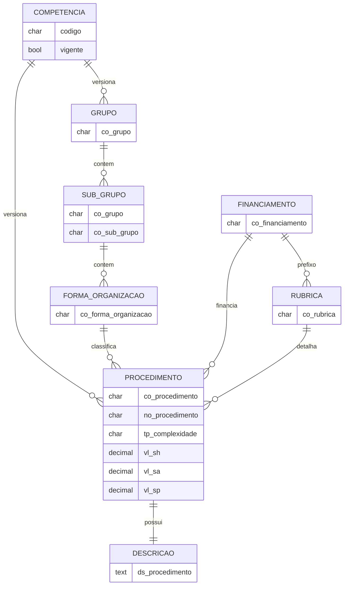
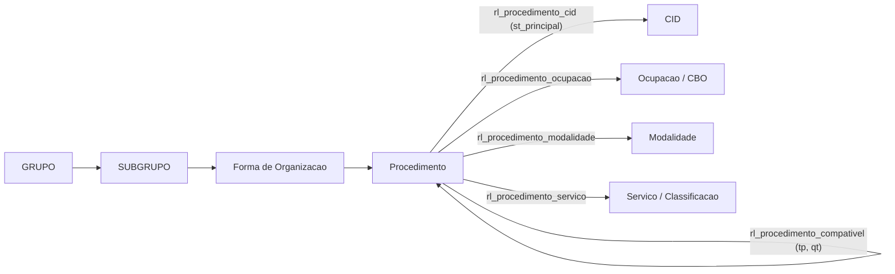

# PRD — Modelo de Dados, API REST e Atualização por Competência do SIGTAP

> **Natureza deste documento:** especificação (PRD) para implementação posterior. Nenhum código de produção é entregue aqui — apenas contratos, decisões e trechos ilustrativos. A fonte da verdade estrutural são os arquivos de layout em `estrutura-sigtap/` (os `*_layout.txt` e o consolidado `layout.txt`), confirmados contra os dados reais do snapshot de competência **202605**.

---

## 1. Visão Geral

Implementar, no projeto Django + Django REST Framework / PostgreSQL já existente, um app `sigtap` que (a) modela a Tabela Unificada de Procedimentos, Medicamentos e OPM do SUS (SIGTAP) e todas as suas tabelas de apoio e de relacionamento; (b) expõe esses dados e suas relações por uma API REST **somente-leitura**, otimizada para consultas de relacionamento (CIDs de um procedimento, procedimentos por CBO, hierarquia grupo→subgrupo→forma de organização, compatibilidades etc.); e (c) oferece um *management command* que importa um pacote mensal do SIGTAP (`AAAAMM`) de forma idempotente e transacional, mantendo uma **janela das N competências mais recentes**.

O SIGTAP é distribuído como arquivos `.txt` de **largura fixa** (posicional), um por tabela, acompanhados de arquivos de layout que definem nome, posição, tamanho e tipo de cada coluna. O pacote mensal é um **snapshot completo** da tabela vigente, não um diff.

---

## 2. Objetivos e Não-Objetivos

**Objetivos:**

- Modelar as **41 tabelas** encontradas nos arquivos (22 de apoio/dicionário + 2 da descrição longa + 17 de relacionamento `rl_*`) mais uma tabela de controle `Competencia`, com `db_table` espelhando o nome do SIGTAP.
- Reconstruir e expor os relacionamentos: hierarquia `grupo→subgrupo→forma_organizacao→procedimento`; `procedimento↔CID`; `procedimento↔ocupação (CBO)`; `procedimento↔modalidade`; `procedimento↔serviço/classificação`; `procedimento↔habilitação/incremento`; compatibilidade `procedimento↔procedimento` e suas exceções; e as demais relações (registro, leito, detalhe, SIA/SIH, origem, regra condicionada, RENASES, rede de atenção, TUSS).
- Entregar uma API REST somente-leitura (DRF) com endpoints de dicionário, de procedimento e de **relação** (diretos e reversos), com busca, filtros (django-filter), ordenação e paginação.
- Entregar o command `importar_sigtap` com parsing posicional correto (encoding ISO-8859-1, recorte por posição, trim, valores monetários em centavos, datas `AAAAMM`, tratamento de vazios e sentinelas), carga transacional, idempotente e com retenção em janela.

**Não-Objetivos:**

- Implementação de código (models, migrations, serializers, command, views) — virá depois, a partir deste PRD.
- Apps de autenticação e cadastro de usuários (já existem; serão reaproveitados apenas para proteger a API — ver Premissas).
- Frontend.
- Download automático dos pacotes do DATASUS (a carga parte de arquivos já extraídos em uma pasta).
- Escrita/edição de dados do SIGTAP via API (a API é estritamente somente-leitura).
- Tradução dos códigos de domínio (`TP_COMPLEXIDADE`, `TP_SEXO`, `TP_COMPATIBILIDADE` etc.) para rótulos legíveis — esses significados **não constam nos arquivos** e ficam sinalizados na seção 10.

---

## 3. Contexto e Premissas

- **Stack:** Python/Django + Django REST Framework, PostgreSQL. Recomenda-se `django-filter` para filtros e (opcional) a extensão PostgreSQL `pg_trgm` para busca textual por nome.
- **Módulos afetados:** novo app Django `sigtap` (`models.py`, `serializers.py`, `views.py`, `filters.py`, `urls.py`, `management/commands/importar_sigtap.py`, `migrations/`, `tests/`). Registro da rota no `urls.py` raiz e do app em `INSTALLED_APPS`. Os apps de auth/usuários **não são tocados**.
- **Arquivos de origem analisados** (em `estrutura-sigtap/`): 41 arquivos de dados `*.txt`; 41 arquivos de layout `*_layout.txt`; o consolidado `layout.txt`; `LEIA_ME.TXT` (changelog histórico); `DATASUS - Tabela de Procedimentos - Lay-out.xls` (layout legível por humano, **não parseado** — os `.txt` de layout foram usados como fonte da verdade); `config.inf` (`Version=1.0.0`), `versao` (`1.1`). Snapshot analisado: competência **202605**.

**Premissas (decisões tomadas — confirmadas pelo usuário ou por julgamento de engenharia):**

- **Histórico em janela de N competências (decisão do usuário):** o banco mantém as **N competências mais recentes** (default proposto **N=12**, configurável). A cada carga, competências além da janela são descartadas. A competência "vigente" para a API é a de maior código `AAAAMM` presente.
- **PK substituta (decisão do usuário):** toda tabela tem `id` `BigAutoField`. A chave natural do SIGTAP vira campo(s) `CharField` com `UniqueConstraint` **incluindo a competência** quando a tabela é versionada. FKs e *through models* usam os `id` substitutos, resolvidos na carga por (chave natural + competência).
- **Tabelas sem `DT_COMPETENCIA` são tratadas como dicionários globais** (ver §5.2 e §6): `tb_cid`, `tb_ocupacao`, `tb_grupo_habilitacao`, `tb_regra_condicionada`, `tb_rede_atencao`, `tb_componente_rede`, `tb_tuss`, `tb_renases`. São feitas *upsert* por chave natural e **não** entram na janela.
- **Relações `rl_*` sem `DT_COMPETENCIA`** (`rl_procedimento_regra_cond`, `rl_procedimento_renases`, `rl_procedimento_comp_rede`, `rl_procedimento_tuss`) recebem, na carga, a competência do pacote importado (carimbo), acompanhando a janela junto do procedimento. *(Decisão de projeto — alternativa em §10.)*
- **Valores monetários** (`VL_SH`, `VL_SA`, `VL_SP`) são inteiros em **centavos**; dividir por 100 → `Decimal` (confirmado: `000000000270` → R$ 2,70).
- **Idade** (`VL_IDADE_MINIMA`/`VL_IDADE_MAXIMA`) é expressa em **meses**; o sentinela `9999` significa "não se aplica" → armazenar `NULL` (LEIA_ME confirma meses e o sentinela).
- **API somente-leitura** com `IsAuthenticated` (reaproveita a autenticação existente). Caso o projeto-alvo deseje a API pública, basta `AllowAny` — sinalizado em §10.
- **Encoding ISO-8859-1 (latin-1)** confirmado nos arquivos (sem BOM; bytes altos só nas tabelas com texto; acentuação correta: "Cólera", "Ações de promoção"). O LEIA_ME registra a padronização em ISO-8859-1.
- **Paginação** `PageNumberPagination`, `page_size` default 50, `max_page_size` 200.

---

## 4. Requisitos Funcionais

### 4.1 Modelagem

- **RF-01 — Inventário completo:** existe um model para cada uma das 41 tabelas dos arquivos, com `Meta.db_table` igual ao nome SIGTAP (`tb_*` / `rl_*`) e `Meta.ordering` pela chave natural. Existe um model adicional `Competencia` (tabela de controle, sem origem direta em arquivo).
- **RF-02 — Tipagem fiel:** códigos com zeros à esquerda são `CharField` (nunca inteiro); quantidades `NUMBER` são `Integer/PositiveInteger`; valores monetários e percentuais são `DecimalField`; `DT_COMPETENCIA` é representada por FK para `Competencia`.
- **RF-03 — Hierarquia:** `SubGrupo→Grupo`, `FormaOrganizacao→SubGrupo` e `Procedimento→FormaOrganizacao` são FKs resolvidas **dentro da mesma competência**. A consistência é verificável: os 6 primeiros dígitos de `CO_PROCEDIMENTO` (grupo+subgrupo+forma) correspondem a uma `FormaOrganizacao` (validado: 0 divergências em 4.984 procedimentos).
- **RF-04 — Relações `rl_*`:** cada `rl_*` é um *through model* explícito com FKs para as pontas e (quando versionada) FK para `Competencia`; relações "limpas" também expõem `ManyToManyField(through=...)` no `Procedimento` para acesso ergonômico (ver §5).
- **RF-05 — Atributos das relações preservados:** `ST_PRINCIPAL` (procedimento↔CID), `TP_COMPATIBILIDADE`/`QT_PERMITIDA` (compatibilidade), `VL_PERCENTUAL_*` (incremento), `NU_GRUPO_HABILITACAO` (habilitação), `TP_PROCEDIMENTO` (SIA/SIH) são campos do *through model* correspondente.

### 4.2 Importação por competência

- **RF-06 — Assinatura:** `python manage.py importar_sigtap --competencia AAAAMM --dir <pasta> [--janela N] [--dry-run]`. A pasta contém os `.txt` de dados de uma competência.
- **RF-07 — Parsing posicional:** cada arquivo é lido em ISO-8859-1, recortado por posição conforme o layout, com `rstrip` de espaços; campos vazios viram `None`; monetários `/100`; idade `9999`→`None`; `ST_PRINCIPAL` `S`→`True`/`N`→`False`.
- **RF-08 — Validação de competência:** quando a tabela possui `DT_COMPETENCIA`, o valor lido deve ser igual ao `--competencia`; divergência aborta a carga com mensagem clara (ou emite aviso conforme política — ver §7).
- **RF-09 — Idempotência + transação:** a carga de uma competência roda em `transaction.atomic()`; reexecutar a mesma competência produz exatamente o mesmo estado (substituição total das linhas daquela competência). Em erro, *rollback* completo; a competência só fica "vigente" após sucesso.
- **RF-10 — Janela:** após sucesso, se o número de competências exceder `N`, as mais antigas são removidas (cascata nas tabelas versionadas). Dicionários globais são *upsert* e não são podados.
- **RF-11 — Ordem de carga e resolução de FK:** dicionários/dimensões primeiro, depois `rl_*`; FKs resolvidas via mapas (chave natural→`id`) carregados para a competência corrente.
- **RF-12 — Arquivo vazio vs ausente:** arquivo presente porém vazio (ex.: `rl_procedimento_tuss.txt`, 0 linhas no snapshot) é carga de 0 linhas sem erro; arquivo **ausente** de uma tabela esperada gera erro (ou aviso, conforme `--strict`).

### 4.3 API REST

- **RF-13 — Somente-leitura:** apenas `GET` (`HEAD`/`OPTIONS`). Qualquer método de escrita retorna 405.
- **RF-14 — Competência na API:** por padrão as consultas usam a competência **vigente**; o parâmetro `?competencia=AAAAMM` permite consultar outra competência da janela. `/competencias/` lista as competências disponíveis e marca a vigente.
- **RF-15 — Recursos de dicionário:** listagem e detalhe de procedimentos, grupos, subgrupos, formas de organização, CIDs, ocupações, modalidades, serviços/classificações, habilitações, financiamentos, rubricas, tipos de leito, registros, detalhes, redes/componentes, RENASES, TUSS, SIA/SIH, regras condicionadas, grupos de habilitação.
- **RF-16 — Relações diretas do procedimento:** `/procedimentos/{co}/cids/`, `/ocupacoes/`, `/modalidades/`, `/servicos/`, `/habilitacoes/`, `/incrementos/`, `/leitos/`, `/registros/`, `/detalhes/`, `/compativeis/`, `/origem/`, `/sia-sih/`, `/regras-condicionadas/`, `/redes/`, `/renases/`, `/tuss/`, `/descricao/`.
- **RF-17 — Relações reversas:** `/ocupacoes/{co}/procedimentos/`, `/cids/{co}/procedimentos/`, `/modalidades/{co}/procedimentos/`, `/servicos/{co}/procedimentos/`, `/habilitacoes/{co}/procedimentos/` (pelo menos as quatro relações destacadas + habilitação).
- **RF-18 — Busca/filtro/paginação:** listas de procedimentos aceitam `search` (código e nome), filtros por hierarquia (`grupo`, `sub_grupo`, `forma_organizacao`), `financiamento`, `modalidade`, `complexidade`, `sexo`; CIDs e ocupações aceitam busca por código/nome; todas as listas são paginadas e ordenáveis.

---

## 5. Modelo de Dados e Contratos de API

### 5.1 Convenções de mapeamento (SIGTAP → Django)

| Origem (layout) | Campo Django | Observações |
|---|---|---|
| `VARCHAR2(n)` de código (`CO_*`, `NU_*`, `CO_RUBRICA`...) | `CharField(max_length=n)` | preserva zeros à esquerda; nunca inteiro |
| `VARCHAR2(n)` de texto (`NO_*`, `DS_*`) | `CharField`/`TextField` | `DS_*` (4000) → `TextField` |
| `CHAR(6)` `DT_COMPETENCIA` | FK → `Competencia` | valor cru = `competencia.codigo`; não é data civil |
| `CHAR(6)` `CO_OCUPACAO` (CBO) | `CharField(6)` | mantido como texto |
| `NUMBER(4)` quantidade (`QT_*`, `VL_IDADE_*`, `VL_CAMPOS_IRRADIADOS`) | `PositiveSmallIntegerField`/`PositiveIntegerField` | `VL_IDADE_* == 9999` → `NULL` |
| `NUMBER(12)` monetário (`VL_SH/SA/SP`) | `DecimalField(max_digits=12, decimal_places=2)` | inteiro em centavos `/100` |
| `NUMBER(7)` percentual (`VL_PERCENTUAL_*`) | `DecimalField(max_digits=7, decimal_places=2)` | `/100` (escala a confirmar — §10) |
| `CHAR(1)` `ST_PRINCIPAL` (`S`/`N`) | `BooleanField` | `S`→`True` |
| `VARCHAR2(1)`/`CHAR(1)` `TP_*` | `CharField(max_length=1, choices=...)` | choices só com os códigos observados; rótulos a confirmar |
| campo posicional em branco | `NULL`/`""` | `rstrip`; vazio → `None` |

Regras gerais de `Meta`: `db_table` = nome SIGTAP; `ordering` pela chave natural; `UniqueConstraint` na chave natural (incluindo `competencia` nas tabelas versionadas); `verbose_name` em português.

### 5.2 Classificação das tabelas (estratégia de competência)

| Classe | Tabelas | Tratamento na carga |
|---|---|---|
| **A — Dimensão versionada** (tem `DT_COMPETENCIA`) | `tb_grupo`, `tb_sub_grupo`, `tb_forma_organizacao`, `tb_financiamento`, `tb_rubrica`, `tb_modalidade`, `tb_registro`, `tb_servico`, `tb_servico_classificacao`, `tb_tipo_leito`, `tb_habilitacao`, `tb_detalhe`, `tb_descricao_detalhe`, `tb_sia_sih`, `tb_procedimento`, `tb_descricao` | FK p/ `Competencia`; única por (chave, competência); entra na janela |
| **B — Relação versionada** (tem `DT_COMPETENCIA`) | `rl_procedimento_cid`, `rl_procedimento_ocupacao`, `rl_procedimento_modalidade`, `rl_procedimento_servico`, `rl_procedimento_leito`, `rl_procedimento_registro`, `rl_procedimento_detalhe`, `rl_procedimento_habilitacao`, `rl_procedimento_incremento`, `rl_procedimento_compativel`, `rl_excecao_compatibilidade`, `rl_procedimento_sia_sih`, `rl_procedimento_origem` | FK p/ `Competencia`; entra na janela |
| **C — Dicionário global** (sem `DT_COMPETENCIA`) | `tb_cid`, `tb_ocupacao`, `tb_grupo_habilitacao`, `tb_regra_condicionada`, `tb_rede_atencao`, `tb_componente_rede`, `tb_tuss`, `tb_renases` | *upsert* por chave natural; sem competência; não podado |
| **D — Relação sem competência** (carimbada na carga) | `rl_procedimento_regra_cond`, `rl_procedimento_renases`, `rl_procedimento_comp_rede`, `rl_procedimento_tuss` | recebe a competência do pacote; entra na janela |

### 5.3 Volumes observados (snapshot 202605) — base para índices

| Tabela | Linhas | Tabela | Linhas | Tabela | Linhas |
|---|--:|---|--:|---|--:|
| rl_procedimento_ocupacao | 194.801 | rl_procedimento_habilitacao | 10.934 | tb_servico_classificacao | 433 |
| rl_procedimento_cid | 81.864 | rl_procedimento_compativel | 12.160 | tb_forma_organizacao | 415 |
| tb_cid | 14.242 | rl_procedimento_detalhe | 10.204 | tb_habilitacao | 346 |
| tb_sia_sih | 8.383 | rl_procedimento_modalidade | 7.975 | tb_renases | 201 |
| rl_procedimento_registro | 7.483 | rl_procedimento_renases | 5.388 | tb_servico | 74 |
| tb_tuss | 5.766 | rl_procedimento_sia_sih | 5.382 | tb_sub_grupo | 67 |
| tb_procedimento | 4.984 | rl_procedimento_leito | 4.118 | tb_detalhe / tb_descricao_detalhe | 51 / 51 |
| tb_descricao | 4.288 | rl_procedimento_servico | 4.109 | tb_rubrica | 42 |
| rl_procedimento_regra_cond | 3.323 | tb_ocupacao | 2.719 | tb_tipo_leito | 41 |
| rl_procedimento_incremento | 2.410 | tb_grupo_habilitacao | 31 | tb_componente_rede | 20 |
| tb_regra_condicionada | 14 | tb_registro | 10 | tb_grupo | 9 |
| tb_financiamento | 7 | rl_excecao_compatibilidade | 5 | tb_rede_atencao | 5 |
| rl_procedimento_origem | 4 | rl_procedimento_comp_rede | 4 | tb_modalidade | 4 |
| **rl_procedimento_tuss** | **0** (vazio no snapshot) | | | | |

### 5.4 Inventário detalhado das tabelas

> Posições no formato `início–fim` (1-indexado), tamanho e tipo conforme os arquivos de layout. "PK natural" indica a chave de negócio (materializada como `UniqueConstraint`, não como PK física).

#### Tabela de controle (sem arquivo de origem)

**`Competencia`** — controla a janela de competências e a proveniência da carga.

| Campo | Tipo Django | Observações |
|---|---|---|
| `id` | BigAutoField | PK |
| `codigo` | CharField(6) | `AAAAMM`, único |
| `importado_em` | DateTimeField | `auto_now_add` |
| `vigente` | BooleanField | derivado/atualizado na carga (maior `codigo`) |

#### Núcleo

**`tb_procedimento` → `Procedimento`** — procedimento (entidade central). PK natural: `CO_PROCEDIMENTO` + competência.

| Coluna | Pos | Tam | Tipo | Campo Django | Observações |
|---|---|--:|---|---|---|
| CO_PROCEDIMENTO | 1–10 | 10 | VARCHAR2 | CharField(10) | chave natural; embute hierarquia (GG SS FF SSS D) |
| NO_PROCEDIMENTO | 11–260 | 250 | VARCHAR2 | CharField(250) | nome |
| TP_COMPLEXIDADE | 261 | 1 | VARCHAR2 | CharField(1) | observados: `0,1,2,3` (rótulos a confirmar) |
| TP_SEXO | 262 | 1 | VARCHAR2 | CharField(1) | observados: `F,I,M,N` |
| QT_MAXIMA_EXECUCAO | 263–266 | 4 | NUMBER | PositiveSmallIntegerField | |
| QT_DIAS_PERMANENCIA | 267–270 | 4 | NUMBER | PositiveSmallIntegerField | |
| QT_PONTOS | 271–274 | 4 | NUMBER | PositiveSmallIntegerField | |
| VL_IDADE_MINIMA | 275–278 | 4 | NUMBER | PositiveSmallIntegerField (null) | meses; `9999`→NULL |
| VL_IDADE_MAXIMA | 279–282 | 4 | NUMBER | PositiveSmallIntegerField (null) | meses; `9999`→NULL |
| VL_SH | 283–294 | 12 | NUMBER | DecimalField(12,2) | centavos `/100` (serviço hospitalar) |
| VL_SA | 295–306 | 12 | NUMBER | DecimalField(12,2) | centavos `/100` (serviço ambulatorial) |
| VL_SP | 307–318 | 12 | NUMBER | DecimalField(12,2) | centavos `/100` (serviço profissional) |
| CO_FINANCIAMENTO | 319–320 | 2 | VARCHAR2 | FK → Financiamento | nunca vazio no snapshot |
| CO_RUBRICA | 321–326 | 6 | VARCHAR2 | FK → Rubrica (null) | vazio em 4.489/4.984 → NULL |
| QT_TEMPO_PERMANENCIA | 327–330 | 4 | NUMBER | PositiveSmallIntegerField | |
| DT_COMPETENCIA | 331–336 | 6 | CHAR | FK → Competencia | |

FKs adicionais reconstruídas: `forma_organizacao` (FK → `FormaOrganizacao`, derivável por `CO_PROCEDIMENTO[1:6]`).

**`tb_descricao` → `Descricao`** — descrição longa do procedimento (1:1). PK natural: `CO_PROCEDIMENTO` + competência.

| Coluna | Pos | Tam | Tipo | Campo Django |
|---|---|--:|---|---|
| CO_PROCEDIMENTO | 1–10 | 10 | VARCHAR2 | OneToOneField → Procedimento |
| DS_PROCEDIMENTO | 11–4010 | 4000 | VARCHAR2 | TextField |
| DT_COMPETENCIA | 4011–4016 | 6 | CHAR | FK → Competencia |

#### Hierarquia

**`tb_grupo` → `Grupo`** · PK natural `CO_GRUPO`+comp.

| Coluna | Pos | Tam | Tipo | Campo |
|---|---|--:|---|---|
| CO_GRUPO | 1–2 | 2 | VARCHAR2 | CharField(2) |
| NO_GRUPO | 3–102 | 100 | VARCHAR2 | CharField(100) |
| DT_COMPETENCIA | 103–108 | 6 | CHAR | FK → Competencia |

**`tb_sub_grupo` → `SubGrupo`** · PK natural (`CO_GRUPO`,`CO_SUB_GRUPO`)+comp · FK `grupo`→`Grupo`.

| Coluna | Pos | Tam | Tipo | Campo |
|---|---|--:|---|---|
| CO_GRUPO | 1–2 | 2 | VARCHAR2 | (compõe FK grupo) |
| CO_SUB_GRUPO | 3–4 | 2 | VARCHAR2 | CharField(2) |
| NO_SUB_GRUPO | 5–104 | 100 | VARCHAR2 | CharField(100) |
| DT_COMPETENCIA | 105–110 | 6 | CHAR | FK → Competencia |

**`tb_forma_organizacao` → `FormaOrganizacao`** · PK natural (`CO_GRUPO`,`CO_SUB_GRUPO`,`CO_FORMA_ORGANIZACAO`)+comp · FK `sub_grupo`→`SubGrupo`.

| Coluna | Pos | Tam | Tipo | Campo |
|---|---|--:|---|---|
| CO_GRUPO | 1–2 | 2 | VARCHAR2 | (compõe FK) |
| CO_SUB_GRUPO | 3–4 | 2 | VARCHAR2 | (compõe FK) |
| CO_FORMA_ORGANIZACAO | 5–6 | 2 | VARCHAR2 | CharField(2) |
| NO_FORMA_ORGANIZACAO | 7–106 | 100 | VARCHAR2 | CharField(100) |
| DT_COMPETENCIA | 107–112 | 6 | CHAR | FK → Competencia |

#### Financiamento

**`tb_financiamento` → `Financiamento`** · PK natural `CO_FINANCIAMENTO`+comp. Ex.: `01`=Atenção Básica (PAB), `06`=MAC, `04`=FAEC (códigos não contíguos).

| Coluna | Pos | Tam | Tipo | Campo |
|---|---|--:|---|---|
| CO_FINANCIAMENTO | 1–2 | 2 | VARCHAR2 | CharField(2) |
| NO_FINANCIAMENTO | 3–102 | 100 | VARCHAR2 | CharField(100) |
| DT_COMPETENCIA | 103–108 | 6 | CHAR | FK → Competencia |

**`tb_rubrica` → `Rubrica`** · PK natural `CO_RUBRICA`+comp. Os 2 primeiros dígitos = tipo de financiamento (LEIA_ME) → FK derivável `financiamento` (a confirmar — §10).

| Coluna | Pos | Tam | Tipo | Campo |
|---|---|--:|---|---|
| CO_RUBRICA | 1–6 | 6 | VARCHAR2 | CharField(6) |
| NO_RUBRICA | 7–106 | 100 | VARCHAR2 | CharField(100) |
| DT_COMPETENCIA | 107–112 | 6 | CHAR | FK → Competencia |

#### Modalidade e instrumento de registro

**`tb_modalidade` → `Modalidade`** · PK natural `CO_MODALIDADE`+comp. Ex.: `01`=Ambulatorial, `02`=Hospitalar, `03`=Hospital Dia, `06`=Atenção Domiciliar.

| Coluna | Pos | Tam | Tipo | Campo |
|---|---|--:|---|---|
| CO_MODALIDADE | 1–2 | 2 | VARCHAR2 | CharField(2) |
| NO_MODALIDADE | 3–102 | 100 | VARCHAR2 | CharField(100) |
| DT_COMPETENCIA | 103–108 | 6 | CHAR | FK → Competencia |

**`tb_registro` → `Registro`** · PK natural `CO_REGISTRO`+comp. Ex.: `01`=BPA (Consolidado), `02`=BPA (Individualizado), `03`=AIH (Proc. Principal).

| Coluna | Pos | Tam | Tipo | Campo |
|---|---|--:|---|---|
| CO_REGISTRO | 1–2 | 2 | VARCHAR2 | CharField(2) |
| NO_REGISTRO | 3–52 | 50 | VARCHAR2 | CharField(50) |
| DT_COMPETENCIA | 53–58 | 6 | CHAR | FK → Competencia |

#### Serviço

**`tb_servico` → `Servico`** · PK natural `CO_SERVICO`+comp.

| Coluna | Pos | Tam | Tipo | Campo |
|---|---|--:|---|---|
| CO_SERVICO | 1–3 | 3 | VARCHAR2 | CharField(3) |
| NO_SERVICO | 4–123 | 120 | VARCHAR2 | CharField(120) |
| DT_COMPETENCIA | 124–129 | 6 | CHAR | FK → Competencia |

**`tb_servico_classificacao` → `ServicoClassificacao`** · PK natural (`CO_SERVICO`,`CO_CLASSIFICACAO`)+comp · FK `servico`→`Servico`.

| Coluna | Pos | Tam | Tipo | Campo |
|---|---|--:|---|---|
| CO_SERVICO | 1–3 | 3 | VARCHAR2 | (compõe FK servico) |
| CO_CLASSIFICACAO | 4–6 | 3 | VARCHAR2 | CharField(3) |
| NO_CLASSIFICACAO | 7–156 | 150 | VARCHAR2 | CharField(150) |
| DT_COMPETENCIA | 157–162 | 6 | CHAR | FK → Competencia |

#### Leito

**`tb_tipo_leito` → `TipoLeito`** · PK natural `CO_TIPO_LEITO`+comp. Ex.: `01`=Cirúrgico, `02`=Obstétricos, `03`=Clínico.

| Coluna | Pos | Tam | Tipo | Campo |
|---|---|--:|---|---|
| CO_TIPO_LEITO | 1–2 | 2 | VARCHAR2 | CharField(2) |
| NO_TIPO_LEITO | 3–62 | 60 | VARCHAR2 | CharField(60) |
| DT_COMPETENCIA | 63–68 | 6 | CHAR | FK → Competencia |

#### CID (dicionário global — sem competência)

**`tb_cid` → `Cid`** · PK natural `CO_CID`. Código de 3–4 caracteres alinhado à esquerda e preenchido com espaço (`A00 ` ≠ `A000`) → normalizar com `rstrip`.

| Coluna | Pos | Tam | Tipo | Campo |
|---|---|--:|---|---|
| CO_CID | 1–4 | 4 | VARCHAR2 | CharField(4) |
| NO_CID | 5–104 | 100 | VARCHAR2 | CharField(100) |
| TP_AGRAVO | 105 | 1 | CHAR | CharField(1) (observado `0,2`) |
| TP_SEXO | 106 | 1 | CHAR | CharField(1) |
| TP_ESTADIO | 107 | 1 | CHAR | CharField(1) |
| VL_CAMPOS_IRRADIADOS | 108–111 | 4 | NUMBER | PositiveSmallIntegerField |

#### Ocupação / CBO (dicionário global — sem competência)

**`tb_ocupacao` → `Ocupacao`** · PK natural `CO_OCUPACAO` (CBO, 6 dígitos).

| Coluna | Pos | Tam | Tipo | Campo |
|---|---|--:|---|---|
| CO_OCUPACAO | 1–6 | 6 | CHAR | CharField(6) |
| NO_OCUPACAO | 7–156 | 150 | VARCHAR2 | CharField(150) |

#### Habilitação

**`tb_habilitacao` → `Habilitacao`** · PK natural `CO_HABILITACAO`+comp.

| Coluna | Pos | Tam | Tipo | Campo |
|---|---|--:|---|---|
| CO_HABILITACAO | 1–4 | 4 | VARCHAR2 | CharField(4) |
| NO_HABILITACAO | 5–154 | 150 | VARCHAR2 | CharField(150) |
| DT_COMPETENCIA | 155–160 | 6 | CHAR | FK → Competencia |

**`tb_grupo_habilitacao` → `GrupoHabilitacao`** (dicionário global — sem competência) · PK natural `NU_GRUPO_HABILITACAO`.

| Coluna | Pos | Tam | Tipo | Campo |
|---|---|--:|---|---|
| NU_GRUPO_HABILITACAO | 1–4 | 4 | VARCHAR2 | CharField(4) |
| NO_GRUPO_HABILITACAO | 5–24 | 20 | VARCHAR2 | CharField(20) |
| DS_GRUPO_HABILITACAO | 25–274 | 250 | VARCHAR2 | CharField(250) |

#### Detalhe

**`tb_detalhe` → `Detalhe`** · PK natural `CO_DETALHE`+comp. Ex.: `001`=Inclui valor da anestesia.

| Coluna | Pos | Tam | Tipo | Campo |
|---|---|--:|---|---|
| CO_DETALHE | 1–3 | 3 | VARCHAR2 | CharField(3) |
| NO_DETALHE | 4–103 | 100 | VARCHAR2 | CharField(100) |
| DT_COMPETENCIA | 104–109 | 6 | CHAR | FK → Competencia |

**`tb_descricao_detalhe` → `DescricaoDetalhe`** · PK natural `CO_DETALHE`+comp (1:1 com `Detalhe`).

| Coluna | Pos | Tam | Tipo | Campo |
|---|---|--:|---|---|
| CO_DETALHE | 1–3 | 3 | VARCHAR2 | OneToOneField → Detalhe |
| DS_DETALHE | 4–4003 | 4000 | VARCHAR2 | TextField |
| DT_COMPETENCIA | 4004–4009 | 6 | CHAR | FK → Competencia |

#### SIA/SIH

**`tb_sia_sih` → `SiaSih`** · PK natural `CO_PROCEDIMENTO_SIA_SIH`+comp. `TP_PROCEDIMENTO` observado: `A` (Ambulatorial), `H` (Hospitalar).

| Coluna | Pos | Tam | Tipo | Campo |
|---|---|--:|---|---|
| CO_PROCEDIMENTO_SIA_SIH | 1–10 | 10 | VARCHAR2 | CharField(10) |
| NO_PROCEDIMENTO_SIA_SIH | 11–110 | 100 | VARCHAR2 | CharField(100) |
| TP_PROCEDIMENTO | 111 | 1 | VARCHAR2 | CharField(1) |
| DT_COMPETENCIA | 112–117 | 6 | CHAR | FK → Competencia |

#### Regra condicionada (dicionário global — sem competência)

**`tb_regra_condicionada` → `RegraCondicionada`** · PK natural `CO_REGRA_CONDICIONADA`. Ex.: `0004`=CONDICIONA INCREMENTO POR CID EXCLUSIVOS.

| Coluna | Pos | Tam | Tipo | Campo |
|---|---|--:|---|---|
| CO_REGRA_CONDICIONADA | 1–4 | 4 | VARCHAR2 | CharField(4) |
| NO_REGRA_CONDICIONADA | 5–154 | 150 | VARCHAR2 | CharField(150) |
| DS_REGRA_CONDICIONADA | 155–4154 | 4000 | VARCHAR2 | TextField |

#### Rede de atenção (dicionários globais — sem competência)

**`tb_rede_atencao` → `RedeAtencao`** · PK natural `CO_REDE_ATENCAO`. Ex.: `092`=Cegonha, `093`=Urgência e Emergência, `094`=Psicossocial.

| Coluna | Pos | Tam | Tipo | Campo |
|---|---|--:|---|---|
| CO_REDE_ATENCAO | 1–3 | 3 | VARCHAR2 | CharField(3) |
| NO_REDE_ATENCAO | 4–53 | 50 | VARCHAR2 | CharField(50) |

**`tb_componente_rede` → `ComponenteRede`** · PK natural `CO_COMPONENTE_REDE` (formato `NN.NN`, ex.: `92.01`) · FK `rede_atencao`→`RedeAtencao`.

| Coluna | Pos | Tam | Tipo | Campo |
|---|---|--:|---|---|
| CO_COMPONENTE_REDE | 1–10 | 10 | VARCHAR2 | CharField(10) |
| NO_COMPONENTE_REDE | 11–160 | 150 | VARCHAR2 | CharField(150) |
| CO_REDE_ATENCAO | 161–163 | 3 | VARCHAR2 | FK → RedeAtencao |

#### TUSS / RENASES (dicionários globais — sem competência)

**`tb_tuss` → `Tuss`** · PK natural `CO_TUSS`.

| Coluna | Pos | Tam | Tipo | Campo |
|---|---|--:|---|---|
| CO_TUSS | 1–10 | 10 | VARCHAR2 | CharField(10) |
| NO_TUSS | 11–460 | 450 | VARCHAR2 | CharField(450) |

**`tb_renases` → `Renases`** · PK natural `CO_RENASES`.

| Coluna | Pos | Tam | Tipo | Campo |
|---|---|--:|---|---|
| CO_RENASES | 1–10 | 10 | VARCHAR2 | CharField(10) |
| NO_RENASES | 11–160 | 150 | VARCHAR2 | CharField(150) |

### 5.5 Tabelas de relacionamento (`rl_*`)

> Todas têm FK para `Procedimento`. As versionadas (classe B) têm FK para `Competencia`; as da classe D recebem a competência da carga. Cada uma vira *through model*; as "limpas" também são expostas como `ManyToManyField(through=...)` no `Procedimento`.

| Tabela → Model | Colunas (Pos/Tam) | Pontas / atributos | Mapeamento |
|---|---|---|---|
| `rl_procedimento_cid` → `ProcedimentoCid` | CO_PROCEDIMENTO(1–10), CO_CID(11–14), ST_PRINCIPAL(15), DT_COMPETENCIA(16–21) | `procedimento`, `cid`, `st_principal:Bool` | M2M `Procedimento.cids` (through) |
| `rl_procedimento_ocupacao` → `ProcedimentoOcupacao` | CO_PROCEDIMENTO(1–10), CO_OCUPACAO(11–16), DT_COMPETENCIA(17–22) | `procedimento`, `ocupacao` | M2M `Procedimento.ocupacoes` |
| `rl_procedimento_modalidade` → `ProcedimentoModalidade` | CO_PROCEDIMENTO(1–10), CO_MODALIDADE(11–12), DT_COMPETENCIA(13–18) | `procedimento`, `modalidade` | M2M `Procedimento.modalidades` |
| `rl_procedimento_servico` → `ProcedimentoServico` | CO_PROCEDIMENTO(1–10), CO_SERVICO(11–13), CO_CLASSIFICACAO(14–16), DT_COMPETENCIA(17–22) | `procedimento`, `servico_classificacao` | M2M → `ServicoClassificacao` |
| `rl_procedimento_leito` → `ProcedimentoLeito` | CO_PROCEDIMENTO(1–10), CO_TIPO_LEITO(11–12), DT_COMPETENCIA(13–18) | `procedimento`, `tipo_leito` | M2M `Procedimento.tipos_leito` |
| `rl_procedimento_registro` → `ProcedimentoRegistro` | CO_PROCEDIMENTO(1–10), CO_REGISTRO(11–12), DT_COMPETENCIA(13–18) | `procedimento`, `registro` | M2M `Procedimento.registros` |
| `rl_procedimento_detalhe` → `ProcedimentoDetalhe` | CO_PROCEDIMENTO(1–10), CO_DETALHE(11–13), DT_COMPETENCIA(14–19) | `procedimento`, `detalhe` | M2M `Procedimento.detalhes` |
| `rl_procedimento_habilitacao` → `ProcedimentoHabilitacao` | CO_PROCEDIMENTO(1–10), CO_HABILITACAO(11–14), NU_GRUPO_HABILITACAO(15–18), DT_COMPETENCIA(19–24) | `procedimento`, `habilitacao`, `grupo_habilitacao` | through (2 FKs de dimensão) |
| `rl_procedimento_incremento` → `ProcedimentoIncremento` | CO_PROCEDIMENTO(1–10), CO_HABILITACAO(11–14), VL_PERCENTUAL_SH(15–21), VL_PERCENTUAL_SA(22–28), VL_PERCENTUAL_SP(29–35), DT_COMPETENCIA(36–41) | `procedimento`, `habilitacao`, 3× `Decimal` | through (percentuais `/100`) |
| `rl_procedimento_compativel` → `ProcedimentoCompativel` | CO_PROC_PRINCIPAL(1–10), CO_REGISTRO_PRINCIPAL(11–12), CO_PROC_COMPATIVEL(13–22), CO_REGISTRO_COMPATIVEL(23–24), TP_COMPATIBILIDADE(25), QT_PERMITIDA(26–29), DT_COMPETENCIA(30–35) | `procedimento_principal`, `procedimento_compativel`, `registro_principal`, `registro_compativel`, `tp_compatibilidade` (`1–5`), `qt_permitida` | through auto-relação |
| `rl_excecao_compatibilidade` → `ExcecaoCompatibilidade` | CO_PROC_RESTRICAO(1–10), CO_PROC_PRINCIPAL(11–20), CO_REGISTRO_PRINCIPAL(21–22), CO_PROC_COMPATIVEL(23–32), CO_REGISTRO_COMPATIVEL(33–34), TP_COMPATIBILIDADE(35), DT_COMPETENCIA(36–41) | `procedimento_restricao` + tripla de compatibilidade | through |
| `rl_procedimento_sia_sih` → `ProcedimentoSiaSih` | CO_PROCEDIMENTO(1–10), CO_PROCEDIMENTO_SIA_SIH(11–20), TP_PROCEDIMENTO(21), DT_COMPETENCIA(22–27) | `procedimento`, `sia_sih`, `tp_procedimento` (`A/H`) | through |
| `rl_procedimento_origem` → `ProcedimentoOrigem` | CO_PROCEDIMENTO(1–10), CO_PROCEDIMENTO_ORIGEM(11–20), DT_COMPETENCIA(21–26) | `procedimento`, `procedimento_origem` | through auto-relação |
| `rl_procedimento_regra_cond` → `ProcedimentoRegraCond` | CO_PROCEDIMENTO(1–10), CO_REGRA_CONDICIONADA(11–14) | `procedimento`, `regra_condicionada` | classe D (competência carimbada) |
| `rl_procedimento_renases` → `ProcedimentoRenases` | CO_PROCEDIMENTO(1–10), CO_RENASES(11–20) | `procedimento`, `renases` | classe D |
| `rl_procedimento_comp_rede` → `ProcedimentoCompRede` | CO_PROCEDIMENTO(1–10), CO_COMPONENTE_REDE(11–20) | `procedimento`, `componente_rede` | classe D |
| `rl_procedimento_tuss` → `ProcedimentoTuss` | CO_PROCEDIMENTO(1–10), CO_TUSS(11–20) | `procedimento`, `tuss` | classe D (vazio no snapshot) |

### 5.6 Trechos ilustrativos de model (não é a implementação)

```python
# Ilustrativo — não implementar a partir daqui; ver Plano (§9).
class Procedimento(models.Model):
    competencia = models.ForeignKey("Competencia", on_delete=models.CASCADE, related_name="procedimentos")
    co_procedimento = models.CharField(max_length=10, db_index=True)
    no_procedimento = models.CharField(max_length=250)
    tp_complexidade = models.CharField(max_length=1, blank=True)
    tp_sexo = models.CharField(max_length=1, blank=True)
    vl_sh = models.DecimalField(max_digits=12, decimal_places=2, default=0)
    vl_sa = models.DecimalField(max_digits=12, decimal_places=2, default=0)
    vl_sp = models.DecimalField(max_digits=12, decimal_places=2, default=0)
    vl_idade_minima = models.PositiveSmallIntegerField(null=True, blank=True)  # meses; 9999->None
    vl_idade_maxima = models.PositiveSmallIntegerField(null=True, blank=True)
    financiamento = models.ForeignKey("Financiamento", on_delete=models.PROTECT, related_name="procedimentos")
    rubrica = models.ForeignKey("Rubrica", null=True, blank=True, on_delete=models.SET_NULL)
    forma_organizacao = models.ForeignKey("FormaOrganizacao", on_delete=models.PROTECT, related_name="procedimentos")
    cids = models.ManyToManyField("Cid", through="ProcedimentoCid", related_name="procedimentos")
    ocupacoes = models.ManyToManyField("Ocupacao", through="ProcedimentoOcupacao", related_name="procedimentos")

    class Meta:
        db_table = "tb_procedimento"
        ordering = ["co_procedimento"]
        constraints = [models.UniqueConstraint(fields=["co_procedimento", "competencia"], name="uq_procedimento_comp")]
        indexes = [models.Index(fields=["competencia", "co_procedimento"])]


class ProcedimentoCid(models.Model):
    competencia = models.ForeignKey("Competencia", on_delete=models.CASCADE)
    procedimento = models.ForeignKey("Procedimento", on_delete=models.CASCADE, related_name="procedimento_cids")
    cid = models.ForeignKey("Cid", on_delete=models.PROTECT, related_name="cid_procedimentos")
    st_principal = models.BooleanField(default=False)  # 'S' -> True

    class Meta:
        db_table = "rl_procedimento_cid"
        constraints = [models.UniqueConstraint(fields=["procedimento", "cid", "competencia"], name="uq_proc_cid_comp")]
        indexes = [models.Index(fields=["cid", "competencia"])]  # consulta reversa procedimentos por CID
```

### 5.7 Endpoints (contratos)

Base: `/api/sigtap/`. Todos `GET` (somente-leitura). Competência default = vigente; `?competencia=AAAAMM` opcional.

| Método | Path | Descrição | Sucesso | Erros |
|---|---|---|---|---|
| GET | `/competencias/` | competências na janela | 200 | 401 |
| GET | `/procedimentos/` | lista (busca/filtros/paginação) | 200 | 401 |
| GET | `/procedimentos/{co}/` | detalhe (com agregados) | 200 | 401, 404 |
| GET | `/procedimentos/{co}/cids/` | CIDs do procedimento (`st_principal`) | 200 | 401, 404 |
| GET | `/procedimentos/{co}/ocupacoes/` | CBOs do procedimento | 200 | 401, 404 |
| GET | `/procedimentos/{co}/modalidades/` | modalidades | 200 | 401, 404 |
| GET | `/procedimentos/{co}/servicos/` | serviços/classificações | 200 | 401, 404 |
| GET | `/procedimentos/{co}/habilitacoes/` | habilitações (+ grupo) | 200 | 401, 404 |
| GET | `/procedimentos/{co}/incrementos/` | incrementos por habilitação | 200 | 401, 404 |
| GET | `/procedimentos/{co}/compativeis/` | compatibilidades | 200 | 401, 404 |
| GET | `/procedimentos/{co}/{leitos,registros,detalhes,sia-sih,origem,regras-condicionadas,redes,renases,tuss,descricao}/` | demais relações | 200 | 401, 404 |
| GET | `/ocupacoes/{co}/procedimentos/` | **procedimentos por CBO** | 200 | 401, 404 |
| GET | `/cids/{co}/procedimentos/` | **procedimentos por CID** | 200 | 401, 404 |
| GET | `/modalidades/{co}/procedimentos/` | procedimentos por modalidade | 200 | 401, 404 |
| GET | `/servicos/{co}/procedimentos/` | procedimentos por serviço | 200 | 401, 404 |
| GET | `/{grupos,subgrupos,formas-organizacao,cids,ocupacoes,modalidades,servicos,habilitacoes,financiamentos,rubricas,tipos-leito,registros,detalhes,redes,componentes-rede,renases,tuss,regras-condicionadas,grupos-habilitacao}/` | dicionários (lista/detalhe) | 200 | 401 |

**Exemplo — `GET /api/sigtap/procedimentos/0202010473/cids/?page=1` → 200:**

```json
{
  "count": 12,
  "next": "http://host/api/sigtap/procedimentos/0202010473/cids/?page=2",
  "previous": null,
  "competencia": "202605",
  "results": [
    { "cid": { "codigo": "C73", "nome": "Neoplasia maligna da glândula tireóide" }, "st_principal": true },
    { "cid": { "codigo": "D093", "nome": "Carcinoma in situ da tireóide" }, "st_principal": true }
  ]
}
```

**Exemplo — `GET /api/sigtap/procedimentos/?search=tomografia&grupo=02&complexidade=3&page=1` → 200:**

```json
{
  "count": 37, "next": "...", "previous": null, "competencia": "202605",
  "results": [
    { "co_procedimento": "0206010079", "no_procedimento": "TOMOGRAFIA COMPUTADORIZADA DO CRANIO",
      "tp_complexidade": "3", "vl_sh": "0.00", "vl_sa": "98.95", "vl_sp": "0.00",
      "financiamento": "06", "grupo": "02", "sub_grupo": "06", "forma_organizacao": "01" }
  ]
}
```

**Exemplo — `GET /api/sigtap/ocupacoes/223605/procedimentos/` → 200:** lista paginada de `{co_procedimento, no_procedimento}` ligados ao CBO `223605` na competência vigente.

### 5.8 Notas de serializer

- Lookup público por **código natural** (`lookup_field="co_procedimento"`, `co_cid`, `co_ocupacao`...), nunca pelo `id` interno.
- Serializers de **lista** enxutos (código + nome + chaves de hierarquia); de **detalhe** com agregados (contagens/links das relações). Monetários expostos como string decimal com 2 casas. `vl_idade_*` em meses (ou `null`).
- Serializers de **relação** retornam o objeto do dicionário aninhado + atributos da relação (ex.: `{cid:{codigo,nome}, st_principal}`; `{habilitacao:{...}, grupo_habilitacao:{...}}`; `{procedimento_compativel:{...}, tp_compatibilidade, qt_permitida, registro_principal, registro_compativel}`).
- Todo payload de lista inclui `competencia` (a competência efetivamente consultada).

---

## 6. Notas de Design Técnico

- **Camada de competência e janela:** `Competencia` é o eixo de versionamento das tabelas das classes A, B e D. A "vigente" é a de maior `codigo`. O default da API resolve a vigente uma vez por request (ex.: filtro/mixin que injeta `competencia` no queryset). Dicionários globais (classe C) não filtram por competência.
- **Resolução de FK na carga (2 passes):** (1) carregar dimensões/dicionários e construir mapas `chave natural → id` para a competência; (2) carregar `rl_*` convertendo códigos em `id`. Os `id` substitutos tornam triviais as auto-relações (`compativel`, `origem`) e as chaves compostas (`servico_classificacao`).
- **Hierarquia redundante e validável:** além das FKs, os 6 primeiros dígitos de `CO_PROCEDIMENTO` reconstroem `grupo+subgrupo+forma`. A carga deve **validar** essa correspondência (em 202605: 100% conferem) e logar divergências em vez de assumir silenciosamente.
- **Normalização de chaves textuais:** aplicar `rstrip` consistente em `CO_CID` (`"C73 "`→`"C73"`) e demais códigos preenchidos com espaço, na dimensão e na relação, para os joins baterem.
- **Índices (orientados às consultas de relação):**
  - `UniqueConstraint(chave_natural, competencia)` em todas as classes A/B; chave natural pura nos dicionários globais.
  - `Index(competencia, co_procedimento)` em `Procedimento` (lookup vigente por código).
  - Nas `rl_*`, índice no **lado reverso** + competência: `Index(cid, competencia)` (procedimentos por CID), `Index(ocupacao, competencia)` (por CBO — tabela de ~195k linhas/competência, índice essencial), idem modalidade/servico/habilitacao.
  - Busca textual por nome: `icontains` atende ao volume (≤14k CIDs, ≤5k procedimentos); para acelerar, índice GIN `pg_trgm` em `no_procedimento`/`no_cid` (opcional).
- **Views:** `ReadOnlyModelViewSet` (lista + detalhe) com `http_method_names = ["get","head","options"]`. Relações como `@action(detail=True)` nos ViewSets de procedimento/dicionário, ou ViewSets dedicados aninhados. `select_related`/`prefetch_related` nas FKs aninhadas para evitar N+1.
- **Filtros:** `django-filter` `FilterSet` por procedimento (`grupo`, `sub_grupo`, `forma_organizacao`, `financiamento`, `modalidade`, `complexidade`, `sexo`, `competencia`); `SearchFilter` (`search` em `co_procedimento`/`no_procedimento`); `OrderingFilter`.
- **Paginação:** `PageNumberPagination` global (`page_size=50`, `max_page_size=200`, `page_size_query_param="page_size"`).
- **Permissões:** `IsAuthenticated` por default (reaproveita auth existente); trocar para `AllowAny` se a API for pública.
- **Command:** classe utilitária com um **registro declarativo de layouts** (tabela → lista de `(campo, início, tamanho, tipo)`) espelhando os arquivos de layout; opção de validar contra `*_layout.txt` no início. Carga em `bulk_create(batch_size≈5000)` dentro de `transaction.atomic()`. `--dry-run` parseia e valida sem gravar.

---

## 7. Casos de Borda e Tratamento de Erros

- **`CO_RUBRICA` em branco (90% das linhas):** → `rubrica = NULL`.
- **`VL_IDADE_* == 9999`:** → `NULL` ("não se aplica").
- **Monetário `000000000000`:** → `Decimal("0.00")`, válido.
- **`CO_CID` preenchido com espaço (`"A00 "`):** `rstrip`; `"A00"` e `"A000"` permanecem distintos.
- **Arquivo presente e vazio (`rl_procedimento_tuss.txt`):** carrega 0 linhas, sem erro.
- **Arquivo de tabela ausente:** erro (modo `--strict`, default) ou aviso e segue (`--no-strict`).
- **Linha com comprimento diferente do esperado:** registrar linha/arquivo e abortar (a integridade posicional é obrigatória; comprimentos por tabela conferidos no snapshot — ex.: `tb_procedimento`=336, `tb_cid`=111, `tb_descricao`=4016).
- **`DT_COMPETENCIA` do arquivo ≠ `--competencia`:** abortar com mensagem clara (evita carregar pacote errado sob a competência informada).
- **FK órfã** (ex.: `CO_PROCEDIMENTO_COMPATIVEL`/`_ORIGEM` ou `CO_CID` sem correspondente): registrar e **pular a linha** (não derrubar a carga toda); contabilizar no relatório final.
- **Chave natural duplicada dentro do mesmo arquivo/competência:** violaria a `UniqueConstraint` → reportar e abortar (indica pacote corrompido).
- **Encoding inesperado / byte inválido em latin-1:** registrar arquivo/linha; a leitura assume ISO-8859-1.
- **Reexecução da mesma competência:** apaga as linhas daquela competência e recarrega → estado idêntico (idempotente).
- **Poda da janela com competência referenciada:** `on_delete=CASCADE` em `Competencia` remove em bloco as tabelas versionadas daquela competência; dicionários globais permanecem.
- **API — `co` inexistente na competência vigente:** 404. **Método de escrita:** 405. **`?competencia` fora da janela:** 404/lista vazia com `count:0` (definir; ver §10).

---

## 8. Critérios de Aceitação

- **AC-01:** Existe este PRD em `docs/prd-sigtap.md` cobrindo as 41 tabelas dos arquivos + `Competencia`, cada uma com finalidade, colunas (nome, posição, tamanho, tipo), chave e relacionamentos.
- **AC-02:** O PRD documenta `procedimento↔CID`, `procedimento↔CBO` e a hierarquia `grupo→subgrupo→forma_organizacao`, já com o mapeamento para models Django.
- **AC-03:** O PRD contém diagramas de entidade-relacionamento (§ a seguir) cobrindo a hierarquia e o leque de relações do procedimento.
- **AC-04:** O PRD especifica o command por competência: estratégia de carga (substituição da competência + janela de N), idempotência, transação, encoding ISO-8859-1, recorte posicional, monetário em centavos `/100`, datas `AAAAMM`, sentinelas e vazios.
- **AC-05:** O PRD define os endpoints somente-leitura das relações (diretas e reversas) e a abordagem de busca/filtro/paginação (`django-filter`) e serializers, com shapes de exemplo.
- **AC-06:** Toda decisão estrutural não respaldada pelos arquivos está marcada como "a confirmar" na §10 (escala de percentual, significados dos `TP_*`, derivação rubrica→financiamento, carimbo de competência das `rl_*` da classe D, `rl_procedimento_tuss` vazio).
- **AC-07:** Nenhum código de implementação foi entregue fora deste PRD (apenas trechos ilustrativos).

> **Critérios para a implementação futura** (orientam as fases do §9, verificáveis em testes): a carga de uma competência é idempotente (reexecutar não duplica nem altera contagens); valores monetários conferem com o esperado (`000000000270`→`2.70`); `GET /procedimentos/{co}/cids/` retorna os CIDs com `st_principal`; `GET /ocupacoes/{co}/procedimentos/` retorna os procedimentos do CBO; a janela mantém no máximo N competências.

---

## Diagramas de Entidade-Relacionamento

### D1 — Hierarquia, atributos diretos do procedimento e competência



### D2 — Leque de relações do procedimento (todas as `rl_*` e seus dicionários)

```mermaid
erDiagram
    PROCEDIMENTO ||--o{ RL_PROCEDIMENTO_CID : tem
    CID ||--o{ RL_PROCEDIMENTO_CID : em
    PROCEDIMENTO ||--o{ RL_PROCEDIMENTO_OCUPACAO : tem
    OCUPACAO ||--o{ RL_PROCEDIMENTO_OCUPACAO : em
    PROCEDIMENTO ||--o{ RL_PROCEDIMENTO_MODALIDADE : tem
    MODALIDADE ||--o{ RL_PROCEDIMENTO_MODALIDADE : em
    PROCEDIMENTO ||--o{ RL_PROCEDIMENTO_SERVICO : tem
    SERVICO_CLASSIFICACAO ||--o{ RL_PROCEDIMENTO_SERVICO : em
    PROCEDIMENTO ||--o{ RL_PROCEDIMENTO_HABILITACAO : tem
    HABILITACAO ||--o{ RL_PROCEDIMENTO_HABILITACAO : em
    GRUPO_HABILITACAO ||--o{ RL_PROCEDIMENTO_HABILITACAO : agrupa
    PROCEDIMENTO ||--o{ RL_PROCEDIMENTO_INCREMENTO : tem
    HABILITACAO ||--o{ RL_PROCEDIMENTO_INCREMENTO : em
    PROCEDIMENTO ||--o{ RL_PROCEDIMENTO_LEITO : tem
    TIPO_LEITO ||--o{ RL_PROCEDIMENTO_LEITO : em
    PROCEDIMENTO ||--o{ RL_PROCEDIMENTO_REGISTRO : tem
    REGISTRO ||--o{ RL_PROCEDIMENTO_REGISTRO : em
    PROCEDIMENTO ||--o{ RL_PROCEDIMENTO_DETALHE : tem
    DETALHE ||--o{ RL_PROCEDIMENTO_DETALHE : em
    PROCEDIMENTO ||--o{ RL_PROCEDIMENTO_SIA_SIH : tem
    SIA_SIH ||--o{ RL_PROCEDIMENTO_SIA_SIH : em
    PROCEDIMENTO ||--o{ RL_PROCEDIMENTO_REGRA_COND : tem
    REGRA_CONDICIONADA ||--o{ RL_PROCEDIMENTO_REGRA_COND : em
    PROCEDIMENTO ||--o{ RL_PROCEDIMENTO_RENASES : tem
    RENASES ||--o{ RL_PROCEDIMENTO_RENASES : em
    PROCEDIMENTO ||--o{ RL_PROCEDIMENTO_COMP_REDE : tem
    COMPONENTE_REDE ||--o{ RL_PROCEDIMENTO_COMP_REDE : em
    REDE_ATENCAO ||--o{ COMPONENTE_REDE : agrupa
    PROCEDIMENTO ||--o{ RL_PROCEDIMENTO_TUSS : tem
    TUSS ||--o{ RL_PROCEDIMENTO_TUSS : em
    PROCEDIMENTO ||--o{ RL_PROCEDIMENTO_ORIGEM : origem
    PROCEDIMENTO ||--o{ RL_PROCEDIMENTO_COMPATIVEL : principal
    PROCEDIMENTO ||--o{ RL_PROCEDIMENTO_COMPATIVEL : compativel
    REGISTRO ||--o{ RL_PROCEDIMENTO_COMPATIVEL : instrumento
    PROCEDIMENTO ||--o{ RL_EXCECAO_COMPATIBILIDADE : restricao

    RL_PROCEDIMENTO_CID {
        bool st_principal
    }
    RL_PROCEDIMENTO_COMPATIVEL {
        char tp_compatibilidade
        int qt_permitida
    }
    RL_PROCEDIMENTO_INCREMENTO {
        decimal vl_percentual_sh
        decimal vl_percentual_sa
        decimal vl_percentual_sp
    }
    RL_PROCEDIMENTO_SIA_SIH {
        char tp_procedimento
    }
    RL_PROCEDIMENTO_HABILITACAO {
        char nu_grupo_habilitacao
    }
```



### D3 — Visão das relações destacadas (resumo)



---

## 9. Plano de Implementação (para IA)

- **Fase 1 — App + `Competencia` + dimensões/dicionários (classes A e C):** criar app `sigtap`, `Competencia` e os models das dimensões e dicionários com `db_table`, `UniqueConstraint` e `ordering`. *Validar:* `makemigrations`/`migrate` sem pendências; criar uma `Competencia` e instâncias de exemplo no shell.
- **Fase 2 — `Procedimento`, `Descricao` e FKs de hierarquia/financiamento:** adicionar FKs (`forma_organizacao`, `financiamento`, `rubrica`) e a OneToOne de descrição. *Validar:* migração aplica; FKs apontam para a competência correta em teste.
- **Fase 3 — Relações `rl_*` (classes B e D):** *through models* com FKs, atributos (`st_principal`, `tp_compatibilidade`, `qt_permitida`, percentuais, `tp_procedimento`, `nu_grupo_habilitacao`) e índices reversos; `ManyToManyField(through=...)` nas relações limpas. *Validar:* migração aplica; índices criados.
- **Fase 4 — Registro de layouts + parser posicional:** registro declarativo (tabela→colunas) espelhando os `*_layout.txt`; funções de recorte/trim/conversão (monetário `/100`, idade `9999`→None, `S/N`→bool, datas). *Validar:* testes unitários do parser com linhas reais do snapshot (ex.: `tb_procedimento`, `tb_cid`, `rl_procedimento_cid`).
- **Fase 5 — Command `importar_sigtap`:** carga em 2 passes, transação, idempotência, validação de competência/comprimento, FK órfã→skip, poda da janela, `--dry-run`, relatório. *Validar:* importar o snapshot 202605; reexecutar e conferir contagens idênticas; validar valores monetários e a janela.
- **Fase 6 — Serializers:** list/detail/relação por código natural, com agregados e `competencia` no payload. *Validar:* testes de serialização.
- **Fase 7 — ViewSets + filtros + paginação + permissões + urls:** `ReadOnlyModelViewSet`, `@action`s de relação (diretas e reversas), `FilterSet`, `SearchFilter`, paginação, `IsAuthenticated`, rotas. *Validar:* chamadas manuais aos endpoints destacados (CIDs de um procedimento; procedimentos por CBO; hierarquia).
- **Fase 8 — Testes de API + QA:** `APITestCase` cobrindo §7 e os endpoints de relação; checagem dos critérios. *Validar:* suíte verde; revisão dos índices sob `EXPLAIN` nas consultas reversas de maior volume.

---

## 10. Perguntas em Aberto / Riscos

- **Escala dos percentuais de incremento (`VL_PERCENTUAL_*`):** valores como `0006667` (→ 66,67%) e `0010764` (→ 107,64%), máximo `0027736` (→ 277,36%), sugerem **2 casas decimais** (`/100`). *Risco:* poderia ser 3 casas (`/1000`). *Confirmar a escala oficial antes de gravar.*
- **Significado dos códigos de domínio:** os rótulos de `TP_COMPLEXIDADE` (`0/1/2/3`), `TP_SEXO` (`F/I/M/N`), `TP_COMPATIBILIDADE` (`1–5`), `TP_AGRAVO`, `TP_ESTADIO`, `VL_CAMPOS_IRRADIADOS` **não constam nos arquivos**. *Decisão atual:* expor o código cru. Mapear para rótulos depende de fonte externa — a confirmar.
- **Derivação rubrica→financiamento:** o LEIA_ME indica que os 2 primeiros dígitos de `CO_RUBRICA` são o tipo de financiamento. *Modelar como FK derivada?* — a confirmar (manter `CO_RUBRICA` íntegro de qualquer forma).
- **`rl_procedimento_tuss` vazio no snapshot 202605 (0 linhas):** confirmar se costuma ser populada em outras competências; o model existe e a carga aceita 0 linhas.
- **`rl_*` sem `DT_COMPETENCIA` (classe D):** decisão atual = carimbar a competência do pacote (acompanha a janela). *Alternativa:* tratá-las como relação corrente única, substituída a cada carga (sem dimensão de competência). Confirmar a preferência.
- **Tamanho da janela `N`:** proposto `N=12`. Confirmar o valor desejado (impacta volume: `rl_procedimento_ocupacao` ~195k linhas por competência).
- **Dicionários globais vs versionados:** `tb_cid`, `tb_ocupacao` etc. não trazem `DT_COMPETENCIA` (o SIGTAP os removeu — LEIA_ME). *Decisão atual:* globais (upsert, sem histórico). Se for necessário histórico desses dicionários, reavaliar.
- **Comportamento de `?competencia` fora da janela:** retornar 404 ou lista vazia (`count:0`)? *Proposta:* 404 em detalhe, lista vazia em listagem. Confirmar.
- **Autenticação da API:** `IsAuthenticated` (default) vs `AllowAny` (dados públicos de referência). Confirmar com a política do projeto.
- **`.xls` de layout não parseado:** os `*_layout.txt` (idênticos ao consolidado `layout.txt`, conferidos contra a largura real de todos os 41 arquivos) foram a fonte da verdade; o `.xls` permanece como referência legível. Se houver descrições de campo úteis no `.xls`, podem enriquecer `help_text` futuramente.
- **Integridade de FK em auto-relações (`compativel`, `origem`) e cross-refs:** assume-se que os códigos referenciados existem na mesma competência; órfãos são pulados e reportados. Avaliar se algum caso exige criação de *stub*.
